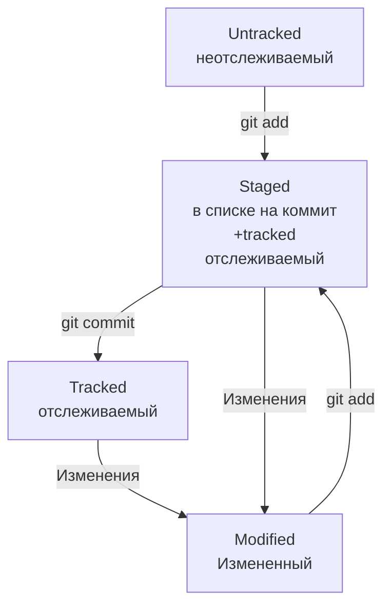

# Шпаргалка по работе с Git

## Описание

Эта шпаргалка поможет Вам начать знакомство с системой Git.

## Содержание

1. Работа с командной строкой (терминалом/консолью)
  * Установка командной строки
  * Базовые команды
2. Работа с Git
  * Базовые команды Git

## Работа с командной строкой

### Установка командной строки

Если Вы используете OS Linux или macOS, то командная строка у Вас уже есть.
Пользователям Windows необходмимо установить консольный инструмент __Git Bash__.

Удобно будет установить пакет __Git for Windows__n, который сразу включает в себя __Git Bash__ и __Git__.

Для этого:
1. Перейдите на официальный сайт [Git](https://git-scm.com/download/win)
2. Из списка __Standalone Installer__ скачайте установщик для своей версии ОС и запустите его
3. Следуйте инструкциям из установщика. Для первоначального использования можно оставлять все опции по умолчанию и нажимать `Next`

### Базовые команды
#### Навигация

* `PWD` - print working directory (англ. показать рабочую директорию).

Возвращает путь к текущей директории `С/Users/USERNAME/.../*текущая директория*`

* `cd *путь*` - change directory (англ. поменять директорию).

Позволяет __передвигаться__ по файловой системе.

Если в путь указать специальный символ `cd ~` можно сразу перейти к домашней директории (директория с файлами пользователя).

С помощью `cd ..` можно перейти в родительскую директорию.

* `ls` - list directory contents (англ. отобразить содержимое директории).

Выводит список файлов и папок в текущей директории

У команды `ls` есть дополнительный флаг `ls -a`, который дополнительно выведет скрытые файлы и папки текущей директории.

#### Создание

* `touch *имя файла.расширение*` - для создания файлов.

Можно создать сразу несколько файлов, записав их через пробел `touch text.txt readme.txt`
  
* `mkdir *имя директории*` - для создания диреткорий.

С помощью ключа `mkdir -p` можно создавать структуру директорий `mkdir -p dir1/dir2/dir3`

#### Копирование / перемещение

* `cp *что копировать* *куда копировать*` - для копирования файлов и папок.

Можно копировать сразу несколько файлов и папок `cp text.txt readme.txt /dir1`

* `mv *что переместить* *куда переместить*` - для перемещения файлов и папок.

Можно переместить сразу несколько файлов и папок `mv text.txt readme.txt /dir1`

#### Чтение

* `cat *имя текстового файла*` - для чтения текстовых файлов

#### Удаление

* `rm *имя файла*` - для удаления файла
  
* `rmdir *имя директории*` - для удаления директории.

Директория будет удалена, если она пустая. Иначе в консоль выведется ошибка `Directory not empty`.

Для удаления не пустых директорий нужно использовать `rm -r *имя директории*`

----

## Работа с Git

### Базовые команды Git

* `git init` делает директорию репозиторием проекта.

Чтобы папка перестала быть репозиторием нужно удалить в ней скрытую подпапку `.git`.

Для этого находясь в репозитории нужно выполнить команду `rm -rf .git`.

Коюч `-r` (от англ. recursive — «рекурсивно») позволяет удалять папки вместе с их содержимым.

Ключ `-f` (от англ. force — «заставить») избавит от вопросов «Вы точно хотите удалить этот файл?».

* `git status` вывод текущего состояния репозитория (имя ветки, спиок файлов и их статус (добавлен, изменен, удален и т.д)).

* `git add` подготовка файла к коммиту (сохранению).

Можно выбрать отдельный файл `git add text.txt`, все файлы  `git add --all`, всю папку  `git add .`

* `git commit` сохраняет внесенные изменения.

Удобно использовать с ключем `git commit -m '*Изменения кратко*'` (от англ. message — «сообщение») чтоб стразу кратко описать суть внесенных изменений.

* `git log` просмотр истории коммитов.

* `git remote add` - связываение локального и удаленного репозитория.

Для связывание необходимо указать 2 параметра: имя удаленного репозитория (принято называть __origin__) и его URL

`git remote add origin *URL*`

* `git push` отправка изменений на удаленный репозиторий.

Перед отправкой изменений необходимо сохранить зименения `git add`, `git commit`.
Если отправка изменений на этот репозиторий происходит впервые, то нужно связать локальные и удаленные ветки такой командой:

`git push -u origin master`, `-u` - ключ для связывания веток, `origin` - имя удаленного репозитория, `master` - имя ветки удаленного репозитория (может называться `main`).

Следующие изменения можно отправлять просто командой `git push`.

### Навигация по коммитам

#### Хэширование коммитов

* Git преобразует информацию о коммитах с помощью алгоритма SHA-1 и для каждого из них рассчитывает уникальный идентификатор — хеш.
* Хеш — основной идентификатор коммита и позволяет узнать его автора, дату и содержимое закоммиченных файлов.
* Все хеши, а также таблицу соответствий `хеш → информация` о коммите Git хранит в папке `.git`.

#### Описание коммита в `git log`

* Лог содержит описание коммита: хеш, автор, дата, сообщение.
* Можно вызвать не только полный лог, но и сокращённый — это делается командой `git log --oneline`.

#### Указатель `HEAD`

`HEAD` - один из служебных файлов папки .git. Он указывает на коммит, который сделан последним (то есть на самый новый).

Если нужно передать последний коммит, то вместо его хеша можно просто написать слово HEAD — Git поймёт, что вы имели в виду последний коммит.

#### Статусы файлов в Git

* `untracked` (англ. «неотслеживаемый»). Git «видит», что такой файл существует, но не следит за изменениями в нём.
* `staged` (англ. «подготовленный»). После выполнения команды `git add` файл попадает в staging area (от англ. stage — «сцена», «этап» и area — «область»), то есть в список файлов, которые войдут в коммит.
* `tracked` (англ. «отслеживаемый»). Все файлы, в которых Git так или иначе отслеживает изменения.
* `modified` (англ. «изменённый»). Состояние `modified` означает, что Git сравнил содержимое файла с последней сохранённой версией и нашёл отличия.

#### Правила оформления сообщений к коммитам

Сообщения коммитов можно сравнить с надписями на коробках в кладовке. Если надписей нет, то нужную коробку будет сложно найти: придётся заглянуть в каждую, чтобы понять, что там. А если надписи есть, то нужная найдётся сразу.

Общие рекомендации:
* относительно коротким, чтобы его было легко прочитать;
* информативным.

Стили оформления:

* Корпоративный.

В корпоративном стиле в начале сообщения обычно указывают Jira-ID, а после — текст сообщения.

`git commit -m "LGS-239: Дополнить список пасхалок новыми числами"`

* Conventional Commits (англ. «соглашение о коммитах»).

Conventional Commits предлагает такой формат коммита: `<type>: <сообщение>`.

Примеры типов:

`feat` (сокращение от англ. feature) — для новой функциональности;
`fix` (от англ. «исправить», «устранить») — для исправленных ошибок.

* GitHub-стиль.

Если коммит «закрывает» или «решает» какую-то задачу (англ. issue), то в его сообщении удобно указывать ссылку на неё.

`git commit -m "Исправить #334, добавить график температуры"`